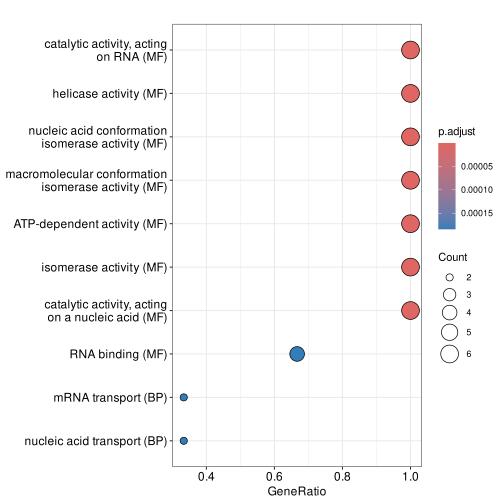

Some scripts to prepare ontology long table for enrichment and GSEA analysis.

## Requirements

```bash
python3 -m pip install pandas owlready2 retrying openpyxl
```

## Fetch ontologies from Oryzabase

- [Oryzabase annotation](https://shigen.nig.ac.jp/rice/oryzabase/download/gene)

```bash
python3 scripts/get_ontologies_from_oryzabase.py
```

## Clean JGI Sitalica annotation info

- [JGI Sitalica annotation](https://data.jgi.doe.gov/refine-download/phytozome?organism=Sitalica)

```bash
python3 scripts/clean_jgi_si_annotation.py
```

## Enrichment Analysis using clusterProfiler

```r
install.packages("readxl")
install.packages("BiocManager")
BiocManager::install("clusterProfiler")
```

```r
onto = readxl::read_excel("results/oryzabase-ontologies.xlsx", sheet="RAP_GO")

gene = c("Os01g0118100", "Os01g0549700", "Os02g0710800", "Os03g0108600", "Os03g0158200", "Os03g0746500")
universe = NULL

enrich_res = clusterProfiler::enricher(
    gene=gene,
    universe=universe,
    TERM2GENE=onto[c("OntoID", "GeneID")],
    TERM2NAME=onto[c("OntoID", "Description")]
)

write.csv(as.data.frame(enrich_res), "enrich_res.csv")

svg("demo_dotplot.svg")
clusterProfiler::dotplot(enrich_res)
dev.off()
```



